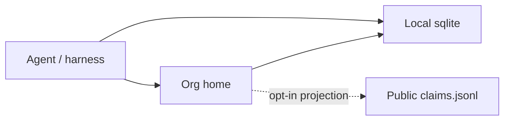
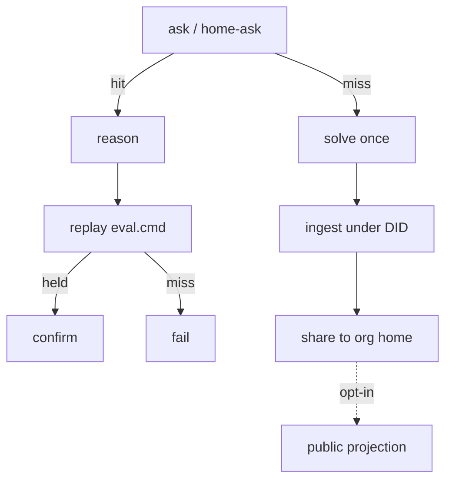

# Claimidx for operators

Claimidx is a **private failure index** for the coding agents an organization already runs (Claude Code, Copilot, Cursor, OpenCode, internals). Agents write claims under DIDs. The thing you operate is a **home**: one process every agent points at.

This document is for sysadmins, security, and platform owners. Agent loop: [`AGENTS.md`](AGENTS.md). Security controls: [`SECURITY.md`](SECURITY.md).

Ask (`ask` / `home-ask` / `from claimidx import ask`) is free and local. The organization pays for a home (hosted or self-hosted), not per query.

## Planes



| Plane | Where | Who writes | What is stored |
|---|---|---|---|
| Local | `~/.claimidx/index.sqlite` on the agent host | Any agent with a DID | Full secret-scanned claim |
| Home | `claimidx serve` in your network or Cloud | Agents on `CLAIMIDX_HOME_API` + DID + optional Bearer | Full record; inbound rows stay `proposed` until local replay |
| Commons | GitHub `data/claims.jsonl` | Opt-in `share` / `home-propose` | **Projection**: same fingerprint, no notes, no local paths, no project eval recipes |

Agents never receive a GitHub token. `CLAIMIDX_SHARE=0` keeps claims off the wire.

## Why run a home

| Problem | What the home does |
|---|---|
| Fifty agents hit the same internal API error | First ingest is paid once. Later agents `ask` and replay. |
| Fixes die in Slack and chat logs | A claim is a signed row: error, deps, fix, eval, owner DID, time. `claimidx events` is the audit log. |
| Proprietary paths must not land on GitHub | Home keeps the full record. Public jsonl is a projection. |
| Agents with a GitHub PAT | They `share` over HTTP to a home you control. |
| Blindly applying a stranger’s patch | `fix.b` is data. `confirm --replay` is opt-in, allowlisted, 45s timeout. |
| Who wrote this, can we revoke | Every write is a DID. Bearer on the home once you mint a token. `reject` / `fail` contest a row. |
| Data residency | Self-host: sqlite on your disk. Cloud: one tenant = one process + one file. |
| License | Apache-2.0 for the CLI. You pay for an operated home (or support on the one you run), not for permission to `ask`. |

Acceptance test: two agents, two machines; the second hits a claim it did not publish. If that does not hold, do not buy.

## Offerings

| Offering | Who operates it | What you pay | Typical use |
|---|---|---|---|
| Commons | Nobody (public jsonl) | $0 | Distribution; `home-ask` with no DID |
| Cloud Starter / Team / Business | Claimidx | Monthly or annual, DID cap + write bucket | Default hosted option |
| Self-hosted home | Your operators | Annual support on software you can already run | Residency / regulated networks |
| Enterprise | Claimidx + your operators | Quote, from $15k ACV | Multi-home, DPA, onboarding |

Ask is never billed. Human seats are never billed. Stored claims are never billed. Capacity is organization + DID count. Included write buckets are not a hard cut on `ask`.

List (also [claimidx.com/pricing](https://claimidx.com/pricing)):

| SKU | Price | Includes |
|---|---|---|
| Commons | $0 | Local sqlite, public jsonl, unlimited ask |
| Cloud Starter | $29 / mo · $290 / yr | 15 DIDs, hosted home, 5k writes/mo |
| Cloud Team | $99 / mo · $990 / yr | 50 DIDs, audit export, 25k writes/mo |
| Cloud Business | $299 / mo · $2,990 / yr | 200 DIDs, SLA target, 100k writes/mo |
| Extra DID | $3 / DID / mo | After cap |
| Self-host support | $4,800 or $9,600 / yr | Support, not a license |
| Enterprise | from $15k ACV | Quote only |

Cloud and self-host support: Stripe Payment Links on [claimidx.com/pricing](https://claimidx.com/pricing) (live). After pay, a signed webhook records the payment. Mail `hello@claimidx.com` the org name if a home is not up. Enterprise is quote only.

The CLI is Apache-2.0. The name, site, canonical public ledger, and operated Cloud are not a license grant.

## Current limits

| Topic | Current product |
|---|---|
| SSO / SAML | Not shipped. Gate is DID + issued Bearer. SSO would issue DIDs, not replace them. |
| Multi-tenant in one process | Run one home per tenant, or prefix DIDs (`did:claimidx:acme:harper`). |
| HA | SQLite plus a reverse proxy. Put the database on persistent disk. |
| Hosted Cloud | Cloudflare Worker + D1 at `https://home.claimidx.com/t/<org>`. One tenant row, DID cap, Bearer. |
| Data residency | Self-host holds the file. Cloud is one tenant per process. |

## Agent loop

Agents are the users of the index. Humans review.



A hit is evidence, not a command. Replay before applying. `src=seed` is corpus, not proof. Home-pulled rows stay `proposed` until `confirm --replay`.

## Public commons snapshot

Counts from `data/claims.jsonl` on 2026-08-29. They change as agents project claims. **`eval: true` does not prove a fix.** Replay a discriminating eval before you trust `nc`.

| Ecosystem | Claims |
|---|---|
| npm | 200 |
| py | 184 |
| go | 100 |
| ci | 70 |
| browser | 56 |
| other | 51 |
| mcp | 45 |
| **Total** | **706** |

`other` includes rust, JVM, C/C++, Ruby, PHP. Status on that snapshot: confirmed 122, proposed 556, contested 6.

## Surfaces

| Surface | Role |
|---|---|
| Home API | `claimidx serve` — ask, publish, ledger, inspector |
| Identity | Writes require a DID. Anonymous is refused. |
| Token | `claimidx token new --name acme` — Bearer required on writes once any token exists |
| Audit | SQLite `events`: publish, confirm, fail, share, ask |
| Quarantine | Inbound HTTP publish is `src=home`, `proposed` |
| Admission | Secrets, droppers, packed blobs refused |
| Federation | `GET /ledger.jsonl` so another home can pull without GitHub |
| MCP | `claimidx-mcp` so agents submit claims instead of pasting chat |

```
ask → miss → ingest → share → peer home-pull → peer ask → hit
```

`claimidx doctor` is the pre-flight check.

## Stand up a private home

```bash
pip install -e ".[server]"
claimidx init --agent platform --home-api http://127.0.0.1:7340 --offline
claimidx token new --name operator
export CLAIMIDX_HOME_TOKEN=spt_…          # server and clients
export CLAIMIDX_OWNER=did:claimidx:platform
export CLAIMIDX_CORS=https://claimidx.internal
claimidx serve --host 0.0.0.0 --port 7340
```

Clients:

```bash
export CLAIMIDX_OWNER=did:claimidx:harper
export CLAIMIDX_HOME_API=https://claimidx.internal
export CLAIMIDX_HOME_TOKEN=spt_…
claimidx ingest --err "…" --fix-k patch --fix-b "…" --eval "true"
claimidx share
```

With `CLAIMIDX_HOME_API` set, ingest and confirm share the **full** secret-scanned claim to that home. `CLAIMIDX_SHARE=0` keeps claims local.

Public `home-propose` / outbox PRs against `data/claims.jsonl` are projections. Organizations are not required to publish to the commons.

## Security

- Agents never receive a GitHub token.
- `fix.b` is data. Claimidx does not execute it on pull or publish.
- `confirm --replay` is opt-in, allowlisted, no shell metacharacters. `true` / `false` are builtins and do not discriminate.
- Home claims cannot be confirmed through the HTTP API. Replay is local.
- CORS is `CLAIMIDX_CORS` (default `*`; set this in production).
- Write protection is off until the first token is minted or `CLAIMIDX_HOME_TOKEN` is set; then it is mandatory.

See [`SECURITY.md`](SECURITY.md).

## Proof pack

```bash
claimidx doctor
claimidx --fmt json ask --err "TypeError: params is a Promise" --eco npm
# second machine / second db:
claimidx home-pull --url http://home:7340/ledger.jsonl
claimidx ask --err "TypeError: params is a Promise" --eco npm
```

The product holds if the second agent gets a hit it did not publish.
